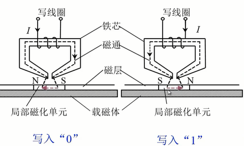
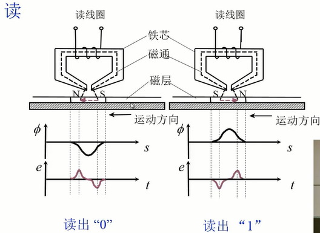

# 概述

- 特点：不直接与CPU交换信息

- 磁表面存储器的技术指标

  - 记录密度：磁道密度$D_t$、位密度$D_b$

  - 存储容量：$C=n\times k \times s$

  - 平均寻址时间：寻道时间+等待时间，辅存的速度（寻址速度、磁头读写时间）

  - 数据传输率：*$D r=D_b\times V$*

  - 误码率：出错信息位数与读出信息的中位数的比值

# 磁记录的原理和记录方式

## 写



## 读



# 硬磁盘存储器

## 应磁盘存储器类型

- 固定磁头和移动磁头

- 可换盘和固定盘

## 硬磁盘存储器结构

```Mermaid
graph LR
  主机<-->磁盘控制器<-->磁盘驱动器<-->盘片
```

### 磁盘驱动器


### 磁盘控制器

- 接收主机发来的命令，转换成磁盘驱动器的控制命令

- 实现主机和驱动器之间的数据格式交换

- 控制磁盘驱动器读写

  - 磁盘驱动器是主机与磁盘驱动器之间的接口（对主机-通过总线、对磁盘）

### 盘片

硬质铝合金结构

# 软盘存储器

## 概述

||硬盘|软盘|
|-|-|-|
|速度|高|低|
|磁头|固定、活动、浮动|活动、接触、盘片|
|盘片|固定盘、盘组大部分不可换|可换盘片|
|价格|高|低|
|环境|苛刻||

## 软盘片


# 光盘存储器

## 概述

采取光存储技术：利用激光写入读出

第一代光存储技术：采用非磁性介质，不可擦写

第二代光存储技术：采用磁性介质，可擦写

## 光盘的存储原理

只读型和只写一次性：热作用（物理或化学）

可擦写光盘：热磁效应


