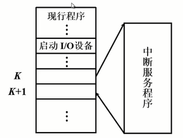
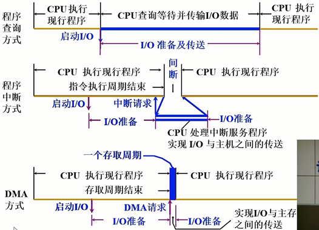

# 输入输出系统的发展情况

## 早期

分散链接：每一个设备都有专门的控制电路

CPU和IO设备**串行**工作，程序查询方式

## 接口模式和DMA阶段

总线连接

CPU和IO设备并行工作

- 中断方式

- DMA方式

## 具有通道结构的阶段

通道：小型处理器，由于和CPU连接

## 具有IO处理机的的阶段

处理机：强大的处理器

> 外部设备的独立性越来越强

# 输入输出系统的组成

## IO软件

- IO指令：CPU指令的一部分

|操作码|命令码|设备码|
|-|-|-|

- 通道指令：通道自身的指令

功能：指出数组的首地址、传送字数、操作命令

举例：IBM/370通道指令为64位

## IO硬件

- 设备 -- IO接口

- 设备 -- 设备控制器 -- 通道

# IO设备与主机的联系方式

## IO设备编址方式

- 统一编址方式：用取数、存数指令，在内存地址比较大时

- 不统一编址\单独编址：有专门的IO指令

## 设备选址

用设备选择电路识别是否被选中

## 传送方式

- 串行：远程、慢速

- 并行：进程、快速

## 联络方式

- 立即响应

- 异步工作采用应答信号

并行

```mermaid
graph LR
  CPU <==>A[IO接口]<===>B[IO设备]
  A-->|Ready|B
  B-->|Strobe|A
```

串行

- 同步工作采用同步时标

# IO设备与主机的连接方式

## 辐射式连接\分散连接

每台设备都配有一套控制线路和遗嘱信号线

**不便于增删设备**

```mermaid
graph LR
  A[主机]
  B[外设I]
  C[外设II]
  D[外设III]
  A<===>B
  A<===>C
  A<===>D
```

## 总线连接

统一标准接口
**便于增删设备**

# IO设备与主机信息传送的控制方式

## 程序查询方式

> 思考：CPU可能出现长期循环情况，与等待响应的原理类型

```mermaid
graph TD
  D[CPU向IO发读指令]-->A[CPU读IO状态]-->B{检查状态}-->|已准备就绪|从IO接口中读一个字到CPU-->从CPU向主存写一个字-->C{完成否}-->|否|D
  C-->|是|是
  B-->|未准备就绪|A
  B-->|出错|出错

```

## 程序中断方式

### IO工作

- 自身准备：CPU不查询

- 与主机交换信息：**CPU暂停现行程序**

### 特点

- **CPU和IO部分的并行工作**

- **没有踏步等待现象，中断现行程序**

> 思考：与协程的工作原理类似

### 程序中断方式流程

## DMA方式

### 特点

- 主存和IO之间有一条直接数据通道

- 不中断现行程序

- 周期挪用（周期窃取）

- **CPU和IO并行工作**

### 工作流程

## 三种方式的CPU工作效率比较

