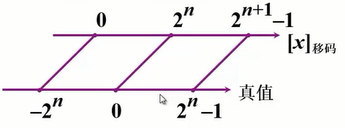

> 定义、特点、举例（机器数与真值的转换，不同机器数形式之间的转化）、机器数表示的范围与字长有关

# 无符号数

将十进制数直接转换为二进制，只包含数值部分

无符号数的表示范围：寄存器的位数

$8bit = 0 \sim 2^8 = 0 \sim 255$

$16bit = 0 \sim 2^{16} = 0 \sim 65536$

# 有符号数

包含数值与符号两部分

## 机器数与真值

真值：带符号的数

机器数：符号数字化的数，小数点位置是约定的结果

举例

|   真值   |  机器数  |
| ------- | ------- |
| +0.1011 | 0 .1011 |
| -0.1011 | 1 .1011 |
| +1100   | 0 1100. |
| -1100   | 1 1100. |

## 原码表示法

### 定义

带符号的绝对值

- 整数

    $[x]_原=\begin{cases}0,x &  2^n>x \ge 0\\2^n-x &0\ge x >-2^n \end{cases}$

    x：真值

    n：整数的位数

    表示范围：$[-2^n-1, 2^n-1]$

    举例

    > 用逗号将符号位和数值部分隔开

|  真值  |          原码          |
| ----- | --------------------- |
| +1110 | 0, 1110               |
| -1110 | $2^4-(-1110)=1, 1110$ |

- 小数

    $[x]_原=\begin{cases}x&1>x≥0\\1-x&0≥x>-1\end{cases}$

    举例

    > 用**小数点**将符号位和数值部分分开

|    真值     |         原码          |
| ---------- | -------------------- |
| +0.1101    | 0. 1101              |
| -0.1101    | $1-(-0.1101)=1.1101$ |
| +0.1000000 | 0.1000000            |
| -0.1000000 | 1.1000000            |

### 举例

|真值|原码|
|-|-|
|-0.0011|1. 0011|
|-1100|1, 1100|
|+0.1101|0.1101|
|0|$[+0.0000]_原=0.0000$
$[-0.0000]_原=1.0000$
$[+0]_原=0, 0000$
$[-0]_原=1, 0000$|

### 特点

- 简单直观

- 不易运算

|要求|数1|数2|实际操作|结果符号|
|-|-|-|-|-|
|加法|正|正|加|正|
|加法|正|负|减|可正可负|
|加法|负|正|减|可正可负|
|加法|负|负|加|负|

## 补码表示法

### 概念

- 将时钟进行调整
  - 逆时针6-3=3；顺时针6+9=15-12=3
- 可见-3可以用+9代替**将减法转化为加法**
- 称+9是-3以12为模的**补数**
- 记作$-3\equiv+9(\mod 12)$
- 同理$-4\equiv+8(\mod 12)$

结论

- 一个负数加上模即为该负数的补数。

- 一个正数和一个负数互为补数时，它们的绝对值之和即为模数。

计数器（mod 16）1011→0000

1011-1011=0000

1011+0101=10000=0000

可见-1011可用+0101替代

记作
$-1011 \equiv+0101(\mod2^4)$

同理
$-011\equiv+101(\mod2^3)$

$-0.10001\equiv +1.0111(\mod 2)$

### 正数的补数即为其本身

两个互为补数的数$-1011\equiv +0101(\mod 2^4)$

分别加上模$10000$

结果仍为补数$+0101\equiv+10101(\mod 2^4)$

可见+0101既可以是+0101也可以是-1011的补数

因此可用1位符号位，0表示正数，1表示负数

用$2^{位数+1}$作为计算的模，可以直接确定符号位的值

如$2^{4+1}+(-1011)=1, 0101$

$2^{4+1}+(+0101)=10, 0101$

### 补码的定义

- 整数
$[x]_补\begin{cases}0,x&2^n>x≥0\\2^{n+1}+x&0>x≥-2^n(\mod2^{n+1})\end{cases}$
$[+0]_补=[-0]_补$
例如

|    真值    |    补数     |
| --------- | ---------- |
| +1010     | 0, 1010    |
| -101 1000 | 1,010 1000 |

- 小数
$[x]_补=\begin{cases}x&1>x≥0\\2+x&0>x≥-1(\mod2)\end{cases}$
例如

|     真值     |            补数             |
| ----------- | -------------------------- |
| +0.1110     | 0.1110                     |
| -0.110 0000 | 2+(-0.110 0000)=1.010 0000 |

### 求补码的快捷方式

设x=-1010时

则$[x]_补=2^{4+1}-1010=11111-1010+1$

当真值为负数时，$补数=\overline{数值位}+1$，符号位为1

当真值为负数时，$原码=\overline{补码}+1=\overline{补码-1}$，符号位为1

> 小技巧：直接将最后一位值为1的前面所有的位取反，直接得到补码的数值部分

## 反码表示法

### 定义

- 整数
$[x]_{反码}=\begin{cases}0,x&2^n>x≥0\\(2^{n+1-1}+x&0≥x>-2^n\end{cases}$

举例

|  真数  |            反码             |
| ----- | -------------------------- |
| +1101 | 0, 1101                    |
| -1101 | $(2^{4+1}-1)-1101=1, 0010$ |

$[+0]=[0,0000]$
$[-0]=[1, 1111]$

- 小数
$[x]_反=\begin{cases}x&1>x≥0\\(2-2^{-n})+x&x≥x>-1(\mod2-2^{-n})\end{cases}$

举例

|   真数   |            反码             |
| ------- | -------------------------- |
| +0.1101 | 0.1101                     |
| -0.1010 | $(2-2^{-4})-0.1010=1.0101$ |

## 小结

- 最高位为符号位，书写上“,”（整数）或“.”（小数）将数值部分和符号位隔开

- 对于正数，原码=补码=反码

- 对于负数，符号位位1，其数值部分

    - 原码除符号位外每位取反末位加1→补码

    - 原码除符号位外每位取反→反码

| 二进制代码 | 无符号数对应的真值 | 原码对应的真值 | 原码对应的真值 | 反码对应的真值 |
| --------- | ---------------- | ------------- | ------------- | ------------- |
| 00000000  | $0$              | $+0$          | $\pm 0$       | $+0$          |
| 00000001  | $1$              | $+1$          | $+1$          | $+1$          |
| 00000010  | $2$              | $+2$          | $+2$          | $+2$          |
| ...       | ...              | ...           | ...           | ...           |
| 01111111  | $127$            | $+127$        | $+127$        | $+127$        |
| 10000000  | $128$            | $-0$          | $-128$        | $-127$        |
| 10000001  | $129$            | $-1$          | $-127$        | $-126$        |
| ...       | ...              | ...           | ...           | ...           |
| 11111101  | $253$            | $-125$        | $-3$          | $-2$          |
| 11111110  | $254$            | $-126$        | $-2$          | $-1$          |
| 11111111  | $255$            | $-127$        | $-1$          | $-0$          |

已知$[y]_补$ 求$[-y]_补$

- 当y>0

    $[y]_补=0, y_1y_2y_3...y_n$

    $[-y]_补=1，\overline{y_1}\overline{y_2}...\overline{y_n}+2^{-n}$

- 当y<0
$[y]_补=1. y_1y_2y_3...y_n$
$[-y]_补=1.\overline{y_1}\overline{y_2}...\overline{y_n}+2^{-n}$
连同符号位在内，每位取反，末位加1

## 移码表示法

补码表示很难直接判断其真值大小

| 十进制 | 二进制  |   补码    |
| ------ | ------ | -------- |
| +21    | +10101 | 0,10101 |
| -21    | -10101 | 1,01011 |
| +31    | +11111 | 0,11111  |
| -31    | -11111 | 1,00001  |

### 定义

$[x]_移=2^n+x(2^n>x≥-2^n)$

小数部分比较阶数和数值部分，都是整数

|  真值   |         移码          |
| ------ | -------------------- |
| 10100  | $2^5+10100=1,110100$ |
| -10100 | $2^5-10100=0,011000$ |

### 移码和补码的比较

|   真值    |    补码     |    移码     |
| -------- | ---------- | ---------- |
| +1100100 | 1，1100100 | 0，1100100 |
| -1100100 | 0，0011100 | 1，0011100 |

补码与移码只差符号位

### 真值、补码和移码的对照表

| 真值x（n=5）  |    $[x]_补$    |   $[x]_移$    | $[x]_移$对应的十进制整数 |
| ------------ | ------------- | ------------ | ---------------------- |
| $-$ 10 0000  | $-$ 10 0000   | $-$00 0000   | 0                      |
| $-$ 1 1111   | $-$ 10 0001   | $-$00 0001   | 1                      |
| $-$ 1 1110   | $-$ 10 0010   | $-$00 0010   | 2                      |
| ...          | ...           | ...          | ...                    |
| $-$ 0 0001   | $-$ 11 1111   | $-$01 1111   | 31                     |
| $\pm$ 0 0000 | $\pm$ 00 0000 | $\pm$10 0000 | 32                     |
| $+$ 0 0001   | $+$ 00 0001   | $+$10 0001   | 33                     |
| $+$ 0 0010   | $+$ 00 0010   | $+$10 0010   | 34                     |
| ...          | ...           | ...          | ...                    |
| $+$ 1 1110   | $+$ 01 1110   | $+$11 1110   | 62                     |
| $+$ 1 1111   | $+$ 01 1111   | $+$11 1111   | 63                     |

### 特点

- 当x=0时$[+0]_移=2^5+0=1,0 0000$

    $[-0]_移=2^5-0=1,0 0000$

    $[+0]_移=[-0]_移$

- 当$n=5$时，最小的真值为$-2^5=-10 0000$

    $[-10 0000]_移=2^5-10 0000=00 0000$

    可见，**最小真值的移码全为0**

    用移码表示浮点数的阶码

