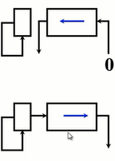
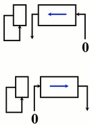
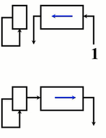
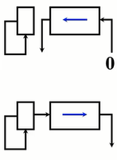
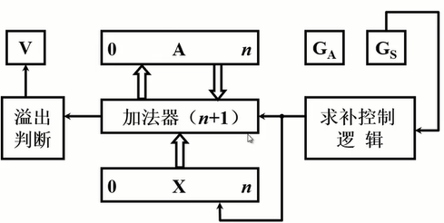
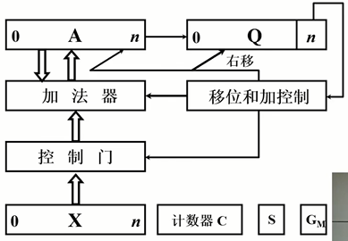
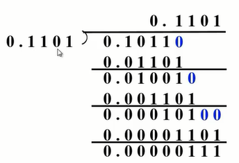
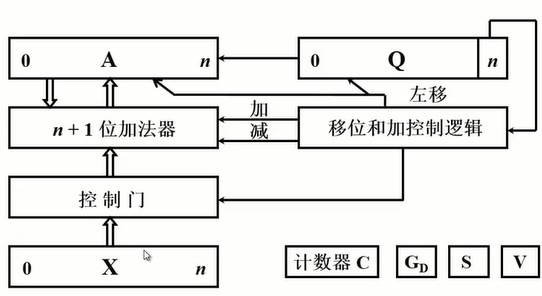

# 移位运算
## 移位的意义
移位：数据相对于小数点进行移动
左移：绝对值扩大，左移1位=数值部分乘以2
右移：绝对值缩小，右移1位=数值部分除以2
在计算机中，移位与加减法配合，能够进行乘除运算

## 算数移位规则
符号位不变
数值按以下规则添补代码

|   操作   | 原码 | 补码 | 反码 |
| -------- | ---- | ---- | ---- |
| 正数移位 | 0    | 0    | 0    |
| 负数左移 | 0    | 0    | 1    |
| 负数右移 | 0    | 1    | 1    |

## 算数移位的硬件实现
### 真值为正
| 方向 |   丢1    | 丢0  |
| ---- | -------- | ---- |
| 左移 | 出错     | 正确 |
| 右移 | 影响精度 | 正确 |

### 负数的原码
| 方向 |   丢1    | 丢0  |
| ---- | -------- | ---- |
| 左移 | 出错     | 正确 |
| 右移 | 影响精度 | 正确 |

### 负数的反码
| 方向 | 丢1  |   丢0    |
| ---- | ---- | -------- |
| 左移 | 正确 | 出错     |
| 右移 | 正确 | 影响精度 |

### 负数的补码
| 方向 |   丢1    | 丢0  |
| ---- | -------- | ---- |
| 左移 | 正确     | 出错 |
| 右移 | 影响精度 | 正确 |

## 算数移位和逻辑移位的区别
- 算数移位：有符号数的移位
- 逻辑移位：无符号数的移位
- 逻辑左移：低位添0，高位丢掉
- 逻辑左移：高位添0，低位丢掉

例如

| 左移 | 01010011 | 右移 | 10110010 |
| ---- | -------- | ---- | -------- |
| 逻辑 | 10100110 | 逻辑 | 01011001 |
| 算数 | 00100110 | 算数 | 11011001 |

# 加减运算
| 要求 | 数1  | 数2  | 实际操作 | 结果符号 |
| ---- | --- | --- | -------- | -------- |
| 加法 | 正   | 正   | 加法     | 正       |
| 加法 | 正   | 负   | 减法     | 可正可负 |
| 加法 | 负   | 正   | 减法     | 可正可负 |
| 加法 | 负   | 负   | 加法     | 负       |

可发现使用原码做加法时，会出现以下问题，通过补码原理可解决
1. 结果符号不确定
2. 实际操作复杂

## 加减法运算公式
连同符号位一起相加，符号位产生的进位自然丢掉
### 加法
- 整数：$[A]_补+[B]_补=[A+B]_补\pmod 2^{n+1}$
- 小数：$[A]_补+[B]_补=[A+B]_补\pmod 2$
### 减法
- 转换$A-B=A+(-B)$
- 整数：$[A+(-B)]_补=[A]_补+[-B]_补\pmod 2^{n+1}$
- 小数：$[A+(-B)]_补=[A]_补+[-B]_补\pmod 2$

## 溢出判断
### 一位符号位判溢出
参加操作的**两个数**（减法时即为被减数和求补以后的减数）**符号相同，其结果的符号与原操作数的符号不同，即为溢出**

硬件实现：最高有效位的进位 异或 符号位的进位=1 溢出
 
### 两位符号位判溢出

$$[x]_{补'}=
\begin{cases}
x&1>x\geq0 \\
4+x&0>x\geq-1 \pmod4
\end{cases}$$
$[x]_{补'}+[y]_{补'}=[x+y]_{补'}\pmod4$
$[x-y]_{补'}=[x]_{补'}+[-y]_{补'}\pmod4$

- 未溢出：结果的双符号位相同
- 溢出：结果的双符号位不同
- 最高符号位代表其真正的符号

## 补码加法器的硬件配置

- $A$：累加器
- $X$：寄存器
- $G_A$：加法标记
- $G_S$：减法标记

# 乘法运算

## 分析笔算乘法

$A=-0.1101$ 
$B=0.1011$
$A\times B=-0.1000 1111$

- 符号位单独处理
- 乘数的某一位决定是否加被乘数
- 4个位积一起相加
- 乘积的位数扩大一倍

## 笔算乘法改进

$$\begin{eqnarray}
A\cdot B& = & A\cdot 0.1011\\
&=&0.1A+0.00A+0.001A+0.0001A\\
&=&0.1A+0.00A+0.001(A+0.1A)\\
&=&0.1A+0.01[0\cdot A+0.1(A+0.1A)]\\
&=&0.1\{A+0.1[0\cdot A+0.1(A+0.1A)]\}\\
&=&2^{-1}\{1\cdot A+2^{-1}[0\cdot A+2^{-1}(1\cdot A+2^{-1}(1\cdot A+0))]\}
\end{eqnarray}$$
其中$2^{-1}$在机器中表示右移1位
1. 被乘数A+0
2. 逻辑右移一位，生成的新的部分积
3. 部分积+被乘数
4. ...

|     部分积     |   乘数    |        说明        |
| ------------- | --------- | ------------------ |
| 0.0000        | 101**1**  | 初态部分积=0        |
| +0.1101       |           | 乘数为1，加被乘数    |
| ------------- | -----     | ------------------ |
| 0.1101        |           |                    |
| 0.0110        | 1 10**1** | ->1，形成新的部分积  |
| +0.1101       |           | 乘数为1，加被乘数    |
| ------------- | -----     | ------------------ |
| 1.0011        | 1         |                    |
| 0.1001        | 11 1**0** | ->1，形成新的部分积  |
| +0.0000       |           | 乘数为0，加0        |
| ------------- | -----     | ------------------ |
| 0.1001        | 11        |                    |
| 0.0100        | 111 **1** | ->1，形成新的部分积  |
| +0.1101       |           | 乘数为1，加被乘数    |
| ------------- | -----     | ------------------ |
| 1.0001        | 111       |                    |
| 0.1000        | 1111      | ->1，得结果         |

- **乘法**运算可用**加和逻辑位移实现** n=4,加4次，移4次
- 由乘数的末位决定被乘数是否与原部分积相加，然后右移1位形成新的部分积，同时乘数右移1位（末位移丢），空出高位存放部分积的低位
- 被乘数只与部分积的高位相加
- 硬件：3个寄存器，其中2个具有位移功能，1个全加器
- 被乘数->x,乘数->MQ寄存器, 高位->ACC

## 原码乘法
### 原码一位乘运算规则
以小数为例
- 设$[x]_原=x_0.x_1x_2\dots x_n$
- $[y]_原=y_0.y_1y_2\dots y_n$
- $[x\cdot y]_原=(x_0\oplus y_0).(0.x_1x_2\dots x_n)(0.y_1y_2...y_n)=(x_0\oplus y_0).x^*y^*$
- $x^*=0.x_1x_2\dots x_n$
- $y^*=0.y_1y_2\dots y_n$
- 乘积的符号单独处理$x_0\oplus y_0$
- 数值部分为绝对值相乘$x^*y^*$

### 原码一位乘递推公式

$$
\begin{eqnarray}x^*\cdot y^* 
& = & x^*(0.y_1y_2\dots y_n)\\ 
& = & x^*(y_12^{-1}+y_22^{-2}\dots y_n2^{-n})\\ 
& = & \underbrace{2^{-1}(y_1x^*+2^{-1}(y_2x^*+\dots\underbrace{2^{-1}(y_nx^*+\underset{\mathcal{z_0}}{0})\dots)}_\mathcal{z_1})}_\mathcal{z_n}  
\end{eqnarray}
$$

特点
- 绝对值运算
- 用移位的次数判断乘法是否结束
- 逻辑移位

### 原码一位乘运算的硬件配置

S：符号位，通过异或符号位得到
G_M：乘法标志
A：加法寄存器，n+1位
X：通用寄存器，n+1位
Q：乘商寄存器，n+1位

# 除法运算
## 分析笔算除法
$x=-0.1011$ $y=0.1011$ 求$x\div y$

$x\div y=-0.1101$
余数0.00000111
- 商符心算求得
- 心算上商
- 余数不动低位补0，减右移一位的除数
- 上商位置不固定

## 笔算除法和机器除法的比较

|            笔算除法             |                  机器除法                  |
| ------------------------------ | ------------------------------------------ |
| 商符单独处理                    | 符号位异或形成                              |
| 心算上商                        | $\|x\|-\|y\|>0$上商1 $\|x\|-\|y\|< 0$上商0 |
| 余数不动低位补0，减右移一位的除数 | 余数左移一位低位补0，减除数                  |
| 2倍字长加法器                   | 1倍字长加法器                               |
| 上商位置不固定                  | 在寄存器最末位上商                           |

## 原码除法
以小数为例
$[x]_原=x_0.x_1x_2\dots x_n$
$[y]_原=y_0.y_1y_2\dots y_n$
$[\frac{x}{y}]_原=(x_0\oplus y_0).\frac{x^*}{y^*}$

式中$x^*=0.x_0.x_1x_2\dots x_n$ 为x的绝对值；$y^*=y_0.y_1y_2\dots y_n$ 为y的绝对值
商的符号位单独处理$x_0\oplus y_0$
数值部分为绝对值相除$\frac{x^*}{y^*}$

约定
- 小数定点除法$x^*<y^*$，整数定点除法$x^*>y^*$
- 被除数不等于0
- 除数不等于0

### 恢复余数法
例如：
x=-0.1011 y=-0.1101 求$[\frac{x}{y}]_原$
$[x]_原=1.1011 [y]_原=1.1101$
$[y^*]_补=0.1101 [-y^*]_补=1.0011$
$x_0\oplus y_0=1\oplus 1=0$

| 被除数（余数）  |      商 |         说明          |
| ------------- | -----: | -------------------- |
| 0.1011        | 0.0000 |                      |
| +1.0011       |        | $+[-y^*]_补$         |
| ------------- |  ----- | -------------------- |
| 1.1110        |      0 | 余数为负，上商0        |
| +0.1101       |        | $恢复余数，+[y^*]_补$ |
| ------------- |  ----- | -------------------- |
| 0.1011        |      0 | 恢复后的余数          |
| 1.0110        |     00 | 逻辑左移1位           |
| +1.0011       |        | $+[-y^*]_补$         |
| ------------- |  ----- | -------------------- |
| 0.1001        |     01 | 余数为负，上商1        |
| 1.0010        |    010 | 逻辑左移1位           |
| +1.0011       |        | $+[-y^*]_补$         |
| ------------- |  ----- | -------------------- |
| 0.0101        |    011 | 余数为正，上商1        |
| 0.1010        |   0110 | 逻辑左移1位           |
| +1.0011       |        | $+[-y^*]_补$         |
| ------------- |  ----- | -------------------- |
| 1.1101        |   0110 | 余数为负，上商0        |
| +0.1101       |        | $恢复余数，+[y^*]_补$ |
| ------------- |  ----- | -------------------- |
| 0.1010        |   0110 | 恢复后的余数          |
| 1.0110        |  01100 | 逻辑左移1位           |
| +1.0011       |        | $+[-y^*]_补$         |
| ------------- |  ----- | -------------------- |
| 0.0111        |  01101 | 余数为正，上商1        |

$\frac{x^*}{y^*}=0.1101$
$\therefore [\frac{x}{y}]_原=0.1101$

- 余数为正$R_i>0$，上商1,$2R_i-y^*$
- 余数为负$R_i<0$，上商0，$R_i+y^*$恢复余数
- 上商n+1次，移位n次
- 第一次上商判断溢出

### 不回复余数法(加减交替)

上商1  $2R_i-y^*$
上商0  $2R_i+y^*$

例如：x=-0.1011 y=-0.1101 求$[\frac{x}{y}]_原$
$[x]_原=1.1011$
$[y]_原=1.1101$
$[y^*]_补=0.1101$
$[-y^*]_补=1.0011$

$x_0\oplus y_0=1\oplus 1=0$

| 被除数（余数） |      商 |      说明       |
| ------------- | -----: | -------------- |
| 0.1011        | 0.0000 |                |
| +1.0011       |        | $+[-y^*]_补$    |
| ------------- |  ----- | -------------- |
| 1.1110        |      0 | 余数为负，上商0  |
| 1.1100        |     0x | <-1            |
| +0.1101       |        | $+[y^*]_补$     |
| ------------- |  ----- | -------------- |
| 0.1001        |     01 | 余数为正，上商1  |
| 1.0010        |    01x | <-1            |
| +1.0011       |        | $+[-y^*]_补$    |
| ------------- |  ----- | -------------- |
| 0.0101        |    011 | 余数为正，上商1  |
| 0.1010        |   011x | <-1            |
| +1.0011       |        | $+[-y^*]_补$    |
| ------------- |  ----- | -------------- |
| 1.1101        |   0110 | 余数为负，上商0  |
| 1.1010        |  0110x | <-1            |
| +0.1101       |        | $+[y^*]_补$     |
| ------------- |  ----- | -------------- |
| 0.00111       | 0.1101 | 余数为正，上商1  |

$\therefore [\frac{x}{y}]_原=0.1101$

- 上商n+1次，移位n次,加法n+1次
- 第一次上商判断溢出
- 用移位的次数判断除法是否结束

### 原码除法硬件配置
加减交替法

A：被除数和余数，n+1位
X：除数，n+1位
Q：商，n+1位
C：计数器，移位次数/加法次数
$G_D$：除法标志
S：符号位
V：是否发生溢出

# 注意
- 乘除法时的位移属于逻辑位移
- 两位符号位可以判断溢出